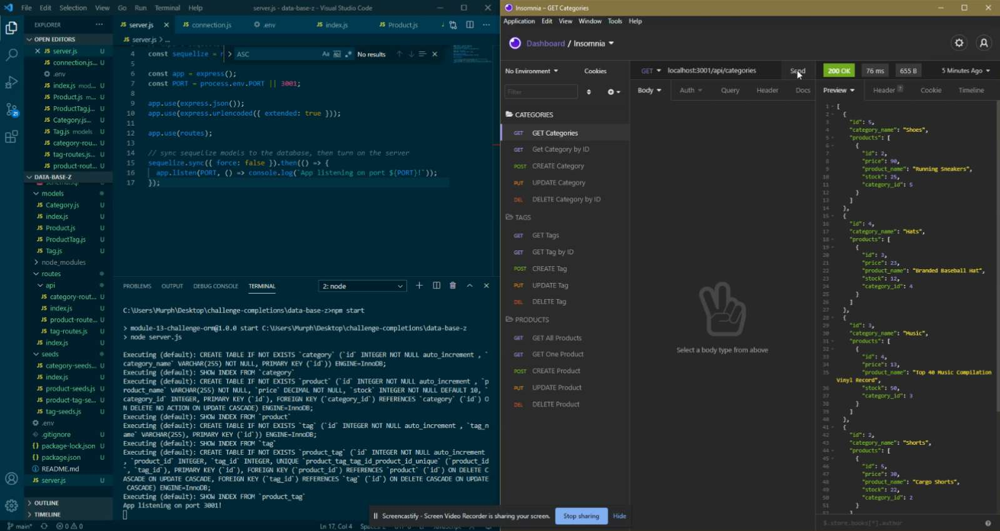

# Data Base Z

## Description

This repo contains a nodejs and mysql based app that retreives relevant product information from a MySQL database through an express server.

## Table of Contents

* [Installation](#installation)

* [Usage](#usage)

* [Credits](#credits)

* [License](#license)

 

* CLI based product database
* Allows for relevant product information retrieval through an api
* Allows user to read, post, update and delete products, tags and categories

 

This backend ecommerce database is great for building a product inventory with interconnected database tables

 

[Data Base Z](https://rickhill543.github.io/data-base-z/)

***

## Installation

To run Data Base Z, either follow the link above or you can copy/clone/fork this repository. Make sure to install the mysql2, express.js, dotenv, and sequalize libraries. "npm init" to intialiaze the package manager followed by "npm install {dependency}". This will setup the necesary packages required.

***

## Usage

This database is intended to be used in conjunction with an e-commerce website to store prouct information such as product name, product category, and product tags.

[DBZ Video Demo](https://drive.google.com/file/d/1eLoorC7VKtBbXZ4ukRr_j2X3C8edNMVH/view)

 

***

## Credits

W3Schools for always being there | 
[W3Schools](https://www.w3schools.com/)

 

***

## License

All Rights Reserved.
